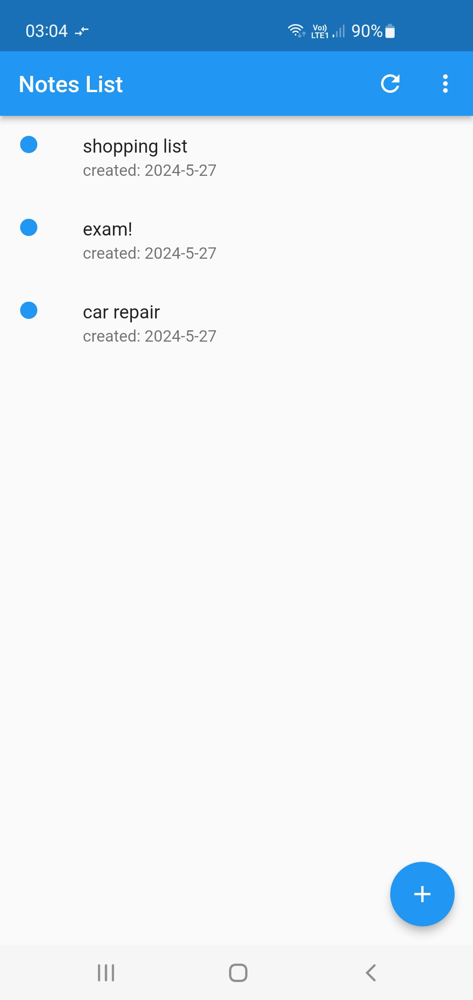
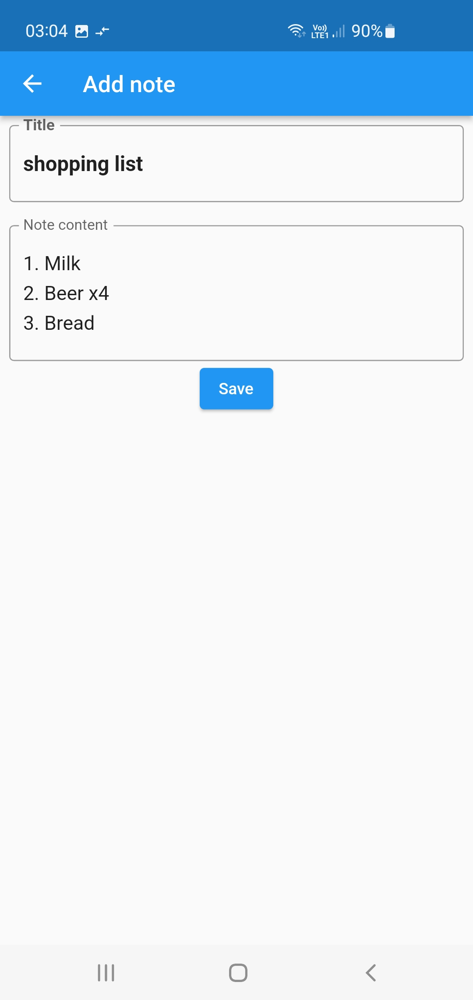
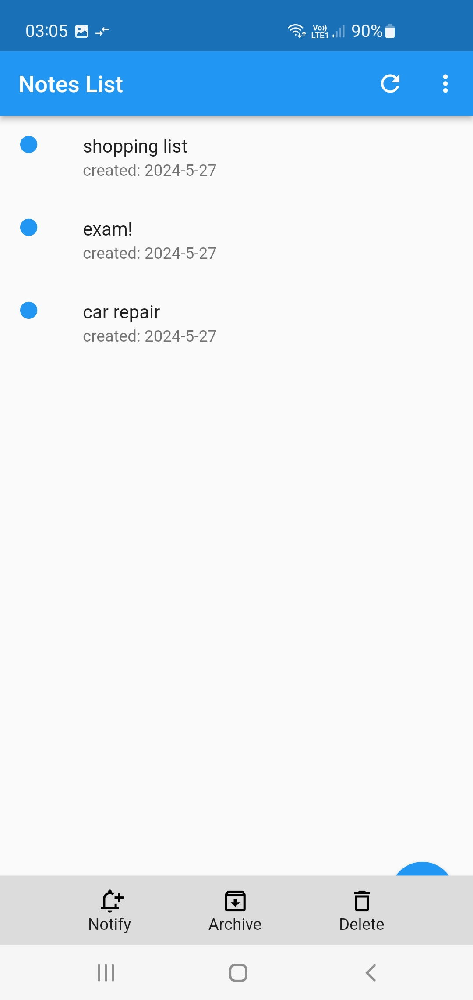
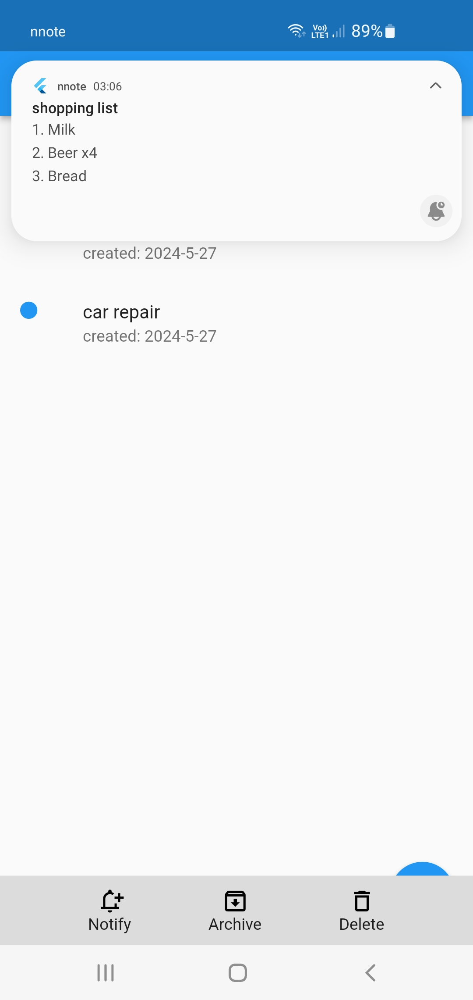

## NNOTE

### Introduction

NNOTE is a mobile application for Android designed for creating notes and generating notifications related to them.

### Functions

- **Add Note:** Create notes with titles and content.
- **Delete Note:** Remove unwanted notes.
- **Archive and Unarchive:** Organize your workspace by archiving notes when not needed.
- **Notification Generation:** Generate Android notifications directly from your notes.

<p align="center">
  
  
  
  
</p>

### Building from Source

To build NNOTE app, follow these steps:

1. **Set Up Your Development Environment:**
   - Install [Flutter SDK](https://flutter.dev/docs/get-started/install) by following the official documentation for your operating system.
   - Ensure you have [Android Studio](https://developer.android.com/studio) installed.

2. **Clone the Repository:**
     ```bash
     git clone https://github.com/rafalkk/nnote.git
     ```

3. **Open the Project in Your IDE:**
   - If you're using Visual Studio Code, open the project folder. Ensure you have the Flutter and Dart extensions installed.
   - If you're using Android Studio, open the project by selecting the root directory of the cloned repository.

4. **Install Dependencies:**
   - In your terminal, ensure you are in the root directory of the project.
   - Run the following command to get all the necessary dependencies:
     ```bash
     flutter pub get
     ```

5. **Generate the APK File:**
   - To compile the project into an APK file, run the following command in your terminal:
     ```bash
     flutter build apk
     ```
   - Once the build process is complete, you will find the generated APK file in the `build/app/outputs/flutter-apk/` directory.